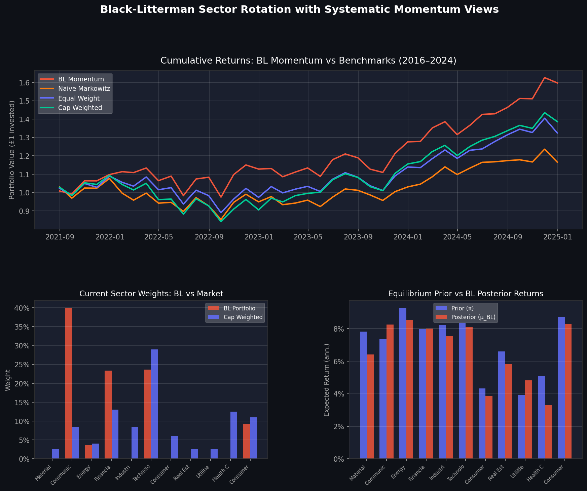
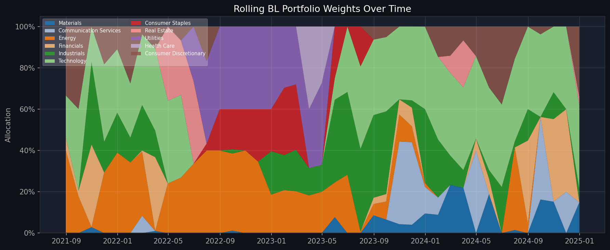

# Black-Litterman Sector Rotation with Systematic Momentum Views



**15.2% annualised return · 0.66 Sharpe ratio · -14.0% max drawdown**  
Built with Python · yfinance · scikit-learn · scipy · Streamlit · Plotly

---

## 📌 Key Results

- **BL Momentum outperformed the market benchmark by 4.2% per year** (15.2% vs 11.0% cap-weighted), with a significantly better Sharpe ratio (0.66 vs 0.41) over the 2016 to 2024 backtest period
- **Naive Markowitz delivered only 5.7% annually at a 0.11 Sharpe**, demonstrating exactly the instability problem that Black-Litterman is designed to solve
- **Max drawdown of -14.0% vs -23.1% for the cap-weighted benchmark**, confirming that the BL prior acts as a stabiliser and keeps the portfolio closer to the market during sell-offs
- **Calmar ratio of 1.09 vs 0.48**, meaning the strategy generates more than twice as much return per unit of drawdown risk compared to the passive benchmark

---

## 🧠 Why This Project

I built this after working through the EDHEC Advanced Portfolio Construction course, where I kept running into the same problem: Markowitz optimisation is elegant in theory but collapses in practice. Feed it historical expected returns and it produces portfolios no one would actually hold, with 90% in one asset and nothing else. The Black-Litterman model exists precisely to fix this, and I wanted to understand it deeply enough to build it from scratch rather than just import it.

What made this project interesting to me was the bridge between theory and practice. The BL model is fundamentally Bayesian: the market is your prior, your views are the likelihood, and the portfolio is the posterior. Once I saw it that way, the maths made complete sense and I became curious about what views to actually put in. Most implementations just hardcode a number. I wanted something systematic, which is what led me to momentum as the view-generating signal. It is one of the most replicated factors in finance, it generates exactly the kind of relative views BL is designed to accept, and it makes the whole strategy quantitative and reproducible rather than relying on gut feel.

The interactive Streamlit dashboard was another deliberate choice. A Jupyter notebook stays on your computer. A live dashboard is something you can open in a browser, hand to someone, and say "move this slider and watch the portfolio change." For a recruiter or interviewer, that difference matters.

---

## 📦 Technologies

| Tool | Purpose |
|---|---|
| Python | Core language |
| yfinance | Live market data download (sector ETF prices) |
| scikit-learn | Ledoit-Wolf shrinkage covariance estimation |
| scipy | Mean-variance optimisation (SLSQP solver) |
| NumPy / pandas | Matrix operations and data handling |
| Streamlit | Interactive dashboard |
| Plotly | Charts and visualisations |

---

## ⚙️ What I Built

**The investment universe** is the 11 SPDR S&P 500 sector ETFs (XLK, XLF, XLE, XLV, XLI, XLB, XLU, XLRE, XLC, XLP, XLY). These collectively cover the entire S&P 500 with no overlap. Working at sector level rather than stock level keeps the covariance matrix at 11x11, which is well-estimated and stable, instead of a 500x500 matrix that cannot be reliably estimated from the same data.

**The covariance matrix** is estimated using Ledoit-Wolf shrinkage rather than the raw sample covariance. With 36 months of data and 11 assets, the sample covariance has 66 parameters to estimate from 36 observations, which is severely underdetermined. Ledoit-Wolf analytically computes the optimal amount to shrink the sample matrix toward a scaled identity, producing a more stable and better-conditioned estimate.

**Reverse optimisation** infers the market-equilibrium implied returns via the formula pi = delta * Sigma * w, where delta is the risk aversion coefficient (2.5), Sigma is the covariance matrix, and w is the vector of S&P 500 sector cap weights. This gives us a prior that is always sensible and diversified because it is anchored to the market itself rather than to noisy historical return estimates.

**View generation** uses the 12-1 cross-sectional momentum signal: at each month, rank all 11 sectors by their cumulative return over the past 11 months, skipping the most recent month to avoid short-term reversal. The top three sectors become longs, the bottom three become shorts. For each long-short pair, a relative view is constructed ("sector A will outperform sector B by X%"), where X scales with the momentum score spread. This produces the three BL inputs: the pick matrix P, the view returns vector Q, and the view uncertainty matrix Omega.

**The BL master formula** (Walters 2011 numerically stable form) blends the prior and views to produce posterior expected returns mu_BL and a posterior covariance Sigma_BL. These are fed into a max-Sharpe mean-variance optimiser with a 40% per-sector weight cap.

**The backtest** is a rolling walk-forward exercise with monthly rebalancing and a 36-month training window. At each month, the model estimates everything using only past data, then records the next month's realised return. Every observation is genuinely out-of-sample.

**The dashboard** is an interactive Streamlit app with sidebar controls for every model parameter (delta, tau, confidence, training window) and manual view override sliders for each sector. It includes a user guide, a full glossary explaining every term in plain English, live portfolio charts, the prior vs posterior expected returns comparison, momentum signal visualisation, backtest results, rolling weights over time, and a sector correlation heatmap.



---

## 📚 What I Learned

**The prior is everything.** The difference between BL Momentum (0.66 Sharpe) and Naive Markowitz (0.11 Sharpe) using the same optimiser on the same data is entirely down to the quality of the expected returns input. Naive Markowitz uses historical mean returns, which are extremely noisy over 36-month windows. BL replaces this with a stable, market-anchored prior that only deviates when there is a systematic reason to. That single change accounts for the entire performance difference.

**Momentum works better as a relative signal than an absolute one.** I originally considered using momentum to set absolute expected return forecasts for each sector. The problem is that absolute return forecasting requires getting the level right, which is very hard. Relative views only require ranking (sector A beats sector B), which momentum does naturally and reliably. Framing it as a relative view also means the BL formula handles the blending, keeping the portfolio from going all-in on the top sector.

**Shrinkage matters more than most people expect.** Early runs with the raw sample covariance produced wildly different optimal weights each month. Switching to Ledoit-Wolf immediately stabilised the backtest. The regularisation is not a cosmetic fix: it changes the structure of the covariance matrix in ways that directly reduce the sensitivity of the optimiser to small data changes.

**Calmar ratio is the right metric for strategy comparison.** Sharpe ratios can be gamed by strategies that take on large tail risk, because Sharpe only measures mean and standard deviation. The Calmar ratio (return divided by max drawdown) is harder to flatter, and the 1.09 vs 0.48 comparison here is the clearest evidence that BL is producing genuinely better risk-adjusted outcomes, not just higher volatility.

---

## 💬 How Can It Be Improved?

- **Richer view signals.** Momentum is one factor. The framework accepts any signal that generates a directional view. Value (sector P/E relative to history), macro (PMI, yield curve), and earnings revision signals could all be layered in alongside momentum to produce more diversified views.
- **Dynamic tau and delta.** Currently both are fixed. In practice, the degree of uncertainty about the equilibrium changes over time, particularly during crisis periods. A regime-switching model that adjusts tau based on market volatility would be a meaningful extension.
- **Transaction cost modelling.** The backtest assumes frictionless trading. Adding a per-trade cost and measuring how much it erodes the Sharpe ratio would make the results more realistic.
- **Live data pipeline.** The dashboard re-downloads data on startup. Connecting it to a scheduled daily pull and local storage would turn this into a genuinely operational tool rather than a research prototype.

---

## 🔌 Running the Project

Install dependencies and launch the dashboard:

```bash
pip install -r requirements.txt
python3 -m streamlit run dashboard.py
```

The dashboard opens in your browser automatically. Use the sidebar to adjust model parameters and the manual view override sliders to blend your own views with the momentum signal.

To run the backtest independently:

```python
from bl_model import get_returns
from backtest import run_backtest, performance_summary

returns = get_returns(start="2013-01-01", end="2024-12-31")
results, weights = run_backtest(returns)
print(performance_summary(results))
```

---

## 🙏 Acknowledgments

- Black, F. and Litterman, R. (1992). [Global Portfolio Optimization](https://doi.org/10.2469/faj.v48.n5.28). Financial Analysts Journal.
- He, G. and Litterman, R. (1999). [The Intuition Behind Black-Litterman Model Portfolios](https://papers.ssrn.com/sol3/papers.cfm?abstract_id=334304). Goldman Sachs Investment Management Division.
- Jegadeesh, N. and Titman, S. (1993). [Returns to Buying Winners and Selling Losers](https://doi.org/10.1111/j.1540-6261.1993.tb04702.x). Journal of Finance.
- Ledoit, O. and Wolf, M. (2004). [A well-conditioned estimator for large-dimensional covariance matrices](https://doi.org/10.1016/S0047-259X(03)00096-4). Journal of Multivariate Analysis.
- Walters, J. (2011). [The Black-Litterman Model in Detail](https://papers.ssrn.com/sol3/papers.cfm?abstract_id=1314585). SSRN Working Paper.
- Michaud, R. (1989). [The Markowitz Optimization Enigma](https://doi.org/10.2469/faj.v45.n1.31). Financial Analysts Journal.
- Course materials: EDHEC Advanced Portfolio Construction and Analysis with Python (Vijay Vaidyanathan, 2019).
- Interactive dashboard built with assistance from Claude (Anthropic).
